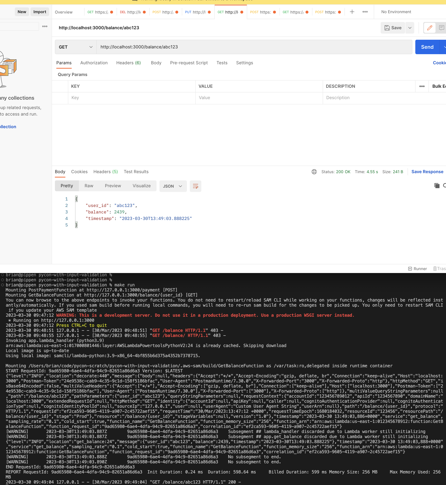
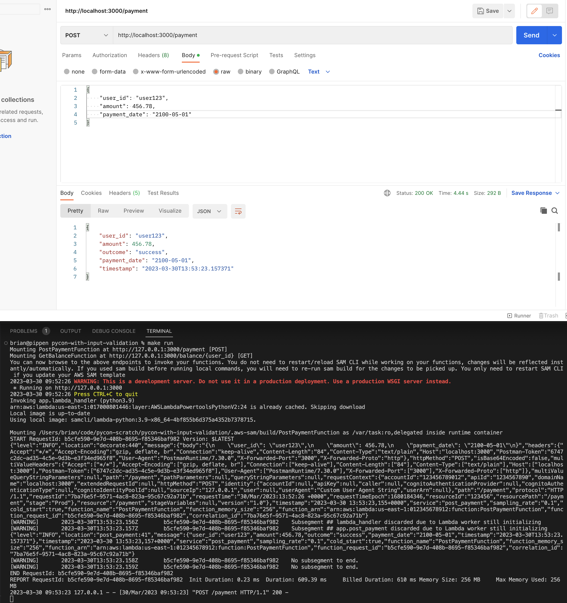

# Interacting with the API Locally

The AWS SAM CLI allows developers to build and test their applications locally without needing to deploy resources to the AWS cloud. This allows for much faster, iterative development cycles.

## Building the API

In order to run the application locally, you will need to first `build` it. The [Makefile](./Makefile) has a target that allows for a clean building of artifacts.

```bash
make all
```

## Invoking the API Locally

There are several mechanisms that can be used to test out functionality. Let's explore the simplest first.

### Passing in Events to Your Serverless Functions

AWS SAM has the ability to simulate the AWS Lambda service locally. You can pass in events and inspect what your function will do. Perhaps even more convenient, the AWS SAM CLI allows developers to generate events that mimic what acutal AWS services generate. 

It's important to test out _valid_ and _invalid_ inputs.

Validation can occur in two places in our serverless application:

* API Gateway

* AWS Lambda function(s)

In this example, validation occurs within the `PostPaymentFunction` and makes use of the [Parser (Pydantic) utility](https://awslabs.github.io/aws-lambda-powertools-python/latest/utilities/parser/).

Consider the flexibility you need when performing validation. In general it is better to have API Gateway perform validation. In this manner, you will reduce unnecessary calls to your backend services. However, you are a bit limited in the validations that can be performed. Please refer to [Amazon API Gateway documentation](https://docs.aws.amazon.com/apigateway/latest/developerguide/api-gateway-method-request-validation.html) for more detail.

#### Testing Valid Inputs

You can test how your `GetBalanceFunction` and `PostPaymentFunction` functions respond to valid inputs.

<details>
<summary>Sending a Valid Balance Request</summary>

You can test out what happens when a valid balance request is made.

```bash
make invoke-valid-get-balance
```

```bash
Invoking app.lambda_handler (python3.9)
arn:aws:lambda:us-east-1:017000801446:layer:AWSLambdaPowertoolsPythonV2:24 is already cached. Skipping download
Local image is up-to-date
Using local image: samcli/lambda-python:3.9-x86_64-4bf855b6d375a4352b7378715.

Mounting /Users/brian/code/pycon-scratch/pycon-with-input-validation/.aws-sam/build/GetBalanceFunction as /var/task:ro,delegated inside runtime container
START RequestId: ef04b2a9-2a57-4b32-ae52-1b2474472199 Version: $LATEST
{"level":"INFO","location":"decorate:440","message":{"body":"","resource":"/balance","path":"/balance/sample-user","httpMethod":"GET","isBase64Encoded":true,"headers":{"Accept":"text/html,application/xhtml+xml,application/xml;q=0.9,image/webp,*/*;q=0.8","Accept-Encoding":"gzip, deflate, sdch","Accept-Language":"en-US,en;q=0.8","Cache-Control":"max-age=0","CloudFront-Forwarded-Proto":"https","CloudFront-Is-Desktop-Viewer":"true","CloudFront-Is-Mobile-Viewer":"false","CloudFront-Is-SmartTV-Viewer":"false","CloudFront-Is-Tablet-Viewer":"false","CloudFront-Viewer-Country":"US","Host":"1234567890.execute-api.us-east-1.amazonaws.com","Upgrade-Insecure-Requests":"1","User-Agent":"Custom User Agent String","Via":"1.1 08f323deadbeefa7af34d5feb414ce27.cloudfront.net (CloudFront)","X-Amz-Cf-Id":"cDehVQoZnx43VYQb9j2-nvCh-9z396Uhbp027Y2JvkCPNLmGJHqlaA==","X-Forwarded-For":"127.0.0.1, 127.0.0.2","X-Forwarded-Port":"443","X-Forwarded-Proto":"https"},"multiValueHeaders":{"Accept":["text/html,application/xhtml+xml,application/xml;q=0.9,image/webp,*/*;q=0.8"],"Accept-Encoding":["gzip, deflate, sdch"],"Accept-Language":["en-US,en;q=0.8"],"Cache-Control":["max-age=0"],"CloudFront-Forwarded-Proto":["https"],"CloudFront-Is-Desktop-Viewer":["true"],"CloudFront-Is-Mobile-Viewer":["false"],"CloudFront-Is-SmartTV-Viewer":["false"],"CloudFront-Is-Tablet-Viewer":["false"],"CloudFront-Viewer-Country":["US"],"Host":["0123456789.execute-api.us-east-1.amazonaws.com"],"Upgrade-Insecure-Requests":["1"],"User-Agent":["Custom User Agent String"],"Via":["1.1 08f323deadbeefa7af34d5feb414ce27.cloudfront.net (CloudFront)"],"X-Amz-Cf-Id":["cDehVQoZnx43VYQb9j2-nvCh-9z396Uhbp027Y2JvkCPNLmGJHqlaA=="],"X-Forwarded-For":["127.0.0.1, 127.0.0.2"],"X-Forwarded-Port":["443"],"X-Forwarded-Proto":["https"]},"requestContext":{"accountId":"123456789012","resourceId":"123456","stage":"v1","requestId":"c6af9ac6-7b61-11e6-9a41-93e8deadbeef","requestTime":"09/Apr/2015:12:34:56 +0000","requestTimeEpoch":1428582896000,"identity":{"cognitoIdentityPoolId":null,"accountId":null,"cognitoIdentityId":null,"caller":null,"accessKey":null,"sourceIp":"127.0.0.1","cognitoAuthenticationType":null,"cognitoAuthenticationProvider":null,"userArn":null,"userAgent":"Custom User Agent String","user":null},"path":"/v1/balance/sample-user","resourcePath":"/balance","httpMethod":"GET","apiId":"1234567890","protocol":"HTTP/1.1"}},"timestamp":"2023-03-30 10:58:12,052+0000","service":"get_balance","sampling_rate":"0.1","cold_start":true,"function_name":"GetBalanceFunction","function_memory_size":"256","function_arn":"arn:aws:lambda:us-east-1:012345678912:function:GetBalanceFunction","function_request_id":"ef04b2a9-2a57-4b32-ae52-1b2474472199","correlation_id":"c6af9ac6-7b61-11e6-9a41-93e8deadbeef"}
[WARNING]       2023-03-30T10:58:12.053Z        ef04b2a9-2a57-4b32-ae52-1b2474472199    Subsegment ## lambda_handler discarded due to Lambda worker still initializing
[WARNING]       2023-03-30T10:58:12.053Z        ef04b2a9-2a57-4b32-ae52-1b2474472199    Subsegment ## app.get_balance discarded due to Lambda worker still initializing
[WARNING]       2023-03-30T10:58:12.054Z        ef04b2a9-2a57-4b32-ae52-1b2474472199    No subsegment to end.
{"level":"INFO","location":"get_balance:24","message":{"user_id":"sample-user","balance":1893,"timestamp":"2023-03-30T10:58:12.053935"},"timestamp":"2023-03-30 10:58:12,053+0000","service":"get_balance","sampling_rate":"0.1","cold_start":true,"function_name":"GetBalanceFunction","function_memory_size":"256","function_arn":"arn:aws:lambda:us-east-1:012345678912:function:GetBalanceFunction","function_request_id":"ef04b2a9-2a57-4b32-ae52-1b2474472199","correlation_id":"c6af9ac6-7b61-11e6-9a41-93e8deadbeef"}
[WARNING]       2023-03-30T10:58:12.054Z        ef04b2a9-2a57-4b32-ae52-1b2474472199    No subsegment to end.
END RequestId: ef04b2a9-2a57-4b32-ae52-1b2474472199
REPORT RequestId: ef04b2a9-2a57-4b32-ae52-1b2474472199  Init Duration: 0.18 ms  Duration: 684.58 ms     Billed Duration: 685 ms Memory Size: 256 MB     Max Memory Used: 256 MB
{"statusCode": 200, "body": "{\"user_id\":\"sample-user\",\"balance\":1893,\"timestamp\":\"2023-03-30T10:58:12.053935\"}", "isBase64Encoded": false, "multiValueHeaders": {"Content-Type": ["application/json"]}}%       
```
</details>

<details>
<summary>Sending a Valid Payment Request</summary>

You can test what happens when a valid payment is made. A valid payment includes a `user_id`, `payment_date` greater than or equal to today, and an `amount` between 1 and 10000.

```bash
make invoke-valid-post-payment 
```

```bash
Invoking app.lambda_handler (python3.9)
arn:aws:lambda:us-east-1:017000801446:layer:AWSLambdaPowertoolsPythonV2:24 is already cached. Skipping download
Local image is up-to-date
Using local image: samcli/lambda-python:3.9-x86_64-4bf855b6d375a4352b7378715.

Mounting /Users/brian/code/pycon-scratch/pycon-with-input-validation/.aws-sam/build/PostPaymentFunction as /var/task:ro,delegated inside runtime container
START RequestId: 964e8d69-edd9-4faf-ad78-f6cb95a6a64d Version: $LATEST
{"level":"INFO","location":"decorate:440","message":{"body":"eyJwYXltZW50X2RhdGUiOiAiMjEwMC0wNS0wMSIsICJhbW91bnQiOiAxMDAwLCAidXNlcl9pZCI6ICJicmlhbiJ9","resource":"/payment","path":"/payment","httpMethod":"POST","isBase64Encoded":true,"headers":{"Accept":"text/html,application/xhtml+xml,application/xml;q=0.9,image/webp,*/*;q=0.8","Accept-Encoding":"gzip, deflate, sdch","Accept-Language":"en-US,en;q=0.8","Cache-Control":"max-age=0","CloudFront-Forwarded-Proto":"https","CloudFront-Is-Desktop-Viewer":"true","CloudFront-Is-Mobile-Viewer":"false","CloudFront-Is-SmartTV-Viewer":"false","CloudFront-Is-Tablet-Viewer":"false","CloudFront-Viewer-Country":"US","Host":"1234567890.execute-api.us-east-1.amazonaws.com","Upgrade-Insecure-Requests":"1","User-Agent":"Custom User Agent String","Via":"1.1 08f323deadbeefa7af34d5feb414ce27.cloudfront.net (CloudFront)","X-Amz-Cf-Id":"cDehVQoZnx43VYQb9j2-nvCh-9z396Uhbp027Y2JvkCPNLmGJHqlaA==","X-Forwarded-For":"127.0.0.1, 127.0.0.2","X-Forwarded-Port":"443","X-Forwarded-Proto":"https"},"multiValueHeaders":{"Accept":["text/html,application/xhtml+xml,application/xml;q=0.9,image/webp,*/*;q=0.8"],"Accept-Encoding":["gzip, deflate, sdch"],"Accept-Language":["en-US,en;q=0.8"],"Cache-Control":["max-age=0"],"CloudFront-Forwarded-Proto":["https"],"CloudFront-Is-Desktop-Viewer":["true"],"CloudFront-Is-Mobile-Viewer":["false"],"CloudFront-Is-SmartTV-Viewer":["false"],"CloudFront-Is-Tablet-Viewer":["false"],"CloudFront-Viewer-Country":["US"],"Host":["0123456789.execute-api.us-east-1.amazonaws.com"],"Upgrade-Insecure-Requests":["1"],"User-Agent":["Custom User Agent String"],"Via":["1.1 08f323deadbeefa7af34d5feb414ce27.cloudfront.net (CloudFront)"],"X-Amz-Cf-Id":["cDehVQoZnx43VYQb9j2-nvCh-9z396Uhbp027Y2JvkCPNLmGJHqlaA=="],"X-Forwarded-For":["127.0.0.1, 127.0.0.2"],"X-Forwarded-Port":["443"],"X-Forwarded-Proto":["https"]},"requestContext":{"accountId":"123456789012","resourceId":"123456","stage":"v1","requestId":"c6af9ac6-7b61-11e6-9a41-93e8deadbeef","requestTime":"09/Apr/2015:12:34:56 +0000","requestTimeEpoch":1428582896000,"identity":{"cognitoIdentityPoolId":null,"accountId":null,"cognitoIdentityId":null,"caller":null,"accessKey":null,"sourceIp":"127.0.0.1","cognitoAuthenticationType":null,"cognitoAuthenticationProvider":null,"userArn":null,"userAgent":"Custom User Agent String","user":null},"path":"/v1/payment","resourcePath":"/payment","httpMethod":"POST","apiId":"1234567890","protocol":"HTTP/1.1"}},"timestamp":"2023-03-30 10:59:55,330+0000","service":"post_payment","sampling_rate":"0.1","cold_start":true,"function_name":"PostPaymentFunction","function_memory_size":"256","function_arn":"arn:aws:lambda:us-east-1:012345678912:function:PostPaymentFunction","function_request_id":"964e8d69-edd9-4faf-ad78-f6cb95a6a64d","correlation_id":"c6af9ac6-7b61-11e6-9a41-93e8deadbeef"}
[WARNING]       2023-03-30T10:59:55.330Z        964e8d69-edd9-4faf-ad78-f6cb95a6a64d    Subsegment ## lambda_handler discarded due to Lambda worker still initializing
[WARNING]       2023-03-30T10:59:55.331Z        964e8d69-edd9-4faf-ad78-f6cb95a6a64d    Subsegment ## app.post_payment discarded due to Lambda worker still initializing
[WARNING]       2023-03-30T10:59:55.332Z        964e8d69-edd9-4faf-ad78-f6cb95a6a64d    No subsegment to end.
[WARNING]       2023-03-30T10:59:55.332Z        964e8d69-edd9-4faf-ad78-f6cb95a6a64d    No subsegment to end.
{"level":"INFO","location":"post_payment:41","message":{"user_id":"brian","amount":1000,"outcome":"success","payment_date":"2100-05-01","timestamp":"2023-03-30T10:59:55.331789"},"timestamp":"2023-03-30 10:59:55,331+0000","service":"post_payment","sampling_rate":"0.1","cold_start":true,"function_name":"PostPaymentFunction","function_memory_size":"256","function_arn":"arn:aws:lambda:us-east-1:012345678912:function:PostPaymentFunction","function_request_id":"964e8d69-edd9-4faf-ad78-f6cb95a6a64d","correlation_id":"c6af9ac6-7b61-11e6-9a41-93e8deadbeef"}
END RequestId: 964e8d69-edd9-4faf-ad78-f6cb95a6a64d
REPORT RequestId: 964e8d69-edd9-4faf-ad78-f6cb95a6a64d  Init Duration: 0.24 ms  Duration: 802.68 ms     Billed Duration: 803 ms Memory Size: 256 MB     Max Memory Used: 256 MB
{"statusCode": 200, "body": "{\"user_id\":\"brian\",\"amount\":1000,\"outcome\":\"success\",\"payment_date\":\"2100-05-01\",\"timestamp\":\"2023-03-30T10:59:55.331789\"}", "isBase64Encoded": false, "multiValueHeaders": {"Content-Type": ["application/json"]}}%  
```
</details>

#### Testing Invalid Inputs

Equally important, you can test how your `GetBalanceFunction` and `PostPaymentFunction` functions respond to invalid inputs.


<details>
<summary>Sending an Invalid Balance Request</summary>

A balance request requires a `user_id` in the URL (eg https://your-api/balance/some-user-id).

```bash
make invoke-invalid-get-balance
```

</details>

<details>
<summary>Sending an Invalid Payment Amount</summary>

You can test out what happens when an invalid payment amount is made.

```bash
make invoke-invalid-amount-post-payment
```

```bash
Invoking app.lambda_handler (python3.9)
arn:aws:lambda:us-east-1:017000801446:layer:AWSLambdaPowertoolsPythonV2:24 is already cached. Skipping download
Local image is up-to-date
Using local image: samcli/lambda-python:3.9-x86_64-4bf855b6d375a4352b7378715.

Mounting /Users/brian/code/pycon-scratch/pycon-with-input-validation/.aws-sam/build/PostPaymentFunction as /var/task:ro,delegated inside runtime container
START RequestId: 301b566f-f989-43e3-89df-464d39709f95 Version: $LATEST
{"level":"INFO","location":"decorate:440","message":{"body":"eyJwYXltZW50X2RhdGUiOiAiMjEwMC0wNS0wMSIsICJhbW91bnQiOiAtMSwgInVzZXJfaWQiOiAiYnJpYW4ifQ==","resource":"/payment","path":"/payment","httpMethod":"POST","isBase64Encoded":true,"headers":{"Accept":"text/html,application/xhtml+xml,application/xml;q=0.9,image/webp,*/*;q=0.8","Accept-Encoding":"gzip, deflate, sdch","Accept-Language":"en-US,en;q=0.8","Cache-Control":"max-age=0","CloudFront-Forwarded-Proto":"https","CloudFront-Is-Desktop-Viewer":"true","CloudFront-Is-Mobile-Viewer":"false","CloudFront-Is-SmartTV-Viewer":"false","CloudFront-Is-Tablet-Viewer":"false","CloudFront-Viewer-Country":"US","Host":"1234567890.execute-api.us-east-1.amazonaws.com","Upgrade-Insecure-Requests":"1","User-Agent":"Custom User Agent String","Via":"1.1 08f323deadbeefa7af34d5feb414ce27.cloudfront.net (CloudFront)","X-Amz-Cf-Id":"cDehVQoZnx43VYQb9j2-nvCh-9z396Uhbp027Y2JvkCPNLmGJHqlaA==","X-Forwarded-For":"127.0.0.1, 127.0.0.2","X-Forwarded-Port":"443","X-Forwarded-Proto":"https"},"multiValueHeaders":{"Accept":["text/html,application/xhtml+xml,application/xml;q=0.9,image/webp,*/*;q=0.8"],"Accept-Encoding":["gzip, deflate, sdch"],"Accept-Language":["en-US,en;q=0.8"],"Cache-Control":["max-age=0"],"CloudFront-Forwarded-Proto":["https"],"CloudFront-Is-Desktop-Viewer":["true"],"CloudFront-Is-Mobile-Viewer":["false"],"CloudFront-Is-SmartTV-Viewer":["false"],"CloudFront-Is-Tablet-Viewer":["false"],"CloudFront-Viewer-Country":["US"],"Host":["0123456789.execute-api.us-east-1.amazonaws.com"],"Upgrade-Insecure-Requests":["1"],"User-Agent":["Custom User Agent String"],"Via":["1.1 08f323deadbeefa7af34d5feb414ce27.cloudfront.net (CloudFront)"],"X-Amz-Cf-Id":["cDehVQoZnx43VYQb9j2-nvCh-9z396Uhbp027Y2JvkCPNLmGJHqlaA=="],"X-Forwarded-For":["127.0.0.1, 127.0.0.2"],"X-Forwarded-Port":["443"],"X-Forwarded-Proto":["https"]},"requestContext":{"accountId":"123456789012","resourceId":"123456","stage":"v1","requestId":"c6af9ac6-7b61-11e6-9a41-93e8deadbeef","requestTime":"09/Apr/2015:12:34:56 +0000","requestTimeEpoch":1428582896000,"identity":{"cognitoIdentityPoolId":null,"accountId":null,"cognitoIdentityId":null,"caller":null,"accessKey":null,"sourceIp":"127.0.0.1","cognitoAuthenticationType":null,"cognitoAuthenticationProvider":null,"userArn":null,"userAgent":"Custom User Agent String","user":null},"path":"/v1/payment","resourcePath":"/payment","httpMethod":"POST","apiId":"1234567890","protocol":"HTTP/1.1"}},"timestamp":"2023-03-30 11:02:10,515+0000","service":"post_payment","sampling_rate":"0.1","cold_start":true,"function_name":"PostPaymentFunction","function_memory_size":"256","function_arn":"arn:aws:lambda:us-east-1:012345678912:function:PostPaymentFunction","function_request_id":"301b566f-f989-43e3-89df-464d39709f95","correlation_id":"c6af9ac6-7b61-11e6-9a41-93e8deadbeef"}
[WARNING]       2023-03-30T11:02:10.516Z        301b566f-f989-43e3-89df-464d39709f95    Subsegment ## lambda_handler discarded due to Lambda worker still initializing
[WARNING]       2023-03-30T11:02:10.516Z        301b566f-f989-43e3-89df-464d39709f95    Subsegment ## app.post_payment discarded due to Lambda worker still initializing
{"level":"ERROR","location":"post_payment:35","message":[{"loc":["amount"],"msg":"amount (-1) must be be between 1 and 10000","type":"value_error"}],"timestamp":"2023-03-30 11:02:10,516+0000","service":"post_payment","sampling_rate":"0.1","cold_start":true,"function_name":"PostPaymentFunction","function_memory_size":"256","function_arn":"arn:aws:lambda:us-east-1:012345678912:function:PostPaymentFunction","function_request_id":"301b566f-f989-43e3-89df-464d39709f95","correlation_id":"c6af9ac6-7b61-11e6-9a41-93e8deadbeef"}
[WARNING]       2023-03-30T11:02:10.516Z        301b566f-f989-43e3-89df-464d39709f95    No subsegment to end.
[WARNING]       2023-03-30T11:02:10.517Z        301b566f-f989-43e3-89df-464d39709f95    No subsegment to end.
END RequestId: 301b566f-f989-43e3-89df-464d39709f95
REPORT RequestId: 301b566f-f989-43e3-89df-464d39709f95  Init Duration: 0.55 ms  Duration: 541.33 ms     Billed Duration: 542 ms Memory Size: 256 MB     Max Memory Used: 256 MB
{"statusCode": 400, "body": "{\"error\":\"Invalid payment\",\"timestamp\":\"2023-03-30T11:02:10.516466\"}", "isBase64Encoded": false, "multiValueHeaders": {"Content-Type": ["application/json"]}}%
```
</details>


<details>
<summary>Sending an Invalid Payment Date</summary>

The payment date must be later than or equal to today's date.

```bash
make invoke-invalid-date-post-payment
```


```bash
Invoking app.lambda_handler (python3.9)
arn:aws:lambda:us-east-1:017000801446:layer:AWSLambdaPowertoolsPythonV2:24 is already cached. Skipping download
Local image is up-to-date
Using local image: samcli/lambda-python:3.9-x86_64-4bf855b6d375a4352b7378715.

Mounting /Users/brian/code/pycon-scratch/pycon-with-input-validation/.aws-sam/build/PostPaymentFunction as /var/task:ro,delegated inside runtime container
START RequestId: 975e4ca7-6391-4581-9c3c-21d09380fda7 Version: $LATEST
{"level":"INFO","location":"decorate:440","message":{"body":"eyJwYXltZW50X2RhdGUiOiAiMTk3MC0wMS0wMSIsICJhbW91bnQiOiAxMDAwLCAidXNlcl9pZCI6ICJicmlhbiJ9","resource":"/payment","path":"/payment","httpMethod":"POST","isBase64Encoded":true,"headers":{"Accept":"text/html,application/xhtml+xml,application/xml;q=0.9,image/webp,*/*;q=0.8","Accept-Encoding":"gzip, deflate, sdch","Accept-Language":"en-US,en;q=0.8","Cache-Control":"max-age=0","CloudFront-Forwarded-Proto":"https","CloudFront-Is-Desktop-Viewer":"true","CloudFront-Is-Mobile-Viewer":"false","CloudFront-Is-SmartTV-Viewer":"false","CloudFront-Is-Tablet-Viewer":"false","CloudFront-Viewer-Country":"US","Host":"1234567890.execute-api.us-east-1.amazonaws.com","Upgrade-Insecure-Requests":"1","User-Agent":"Custom User Agent String","Via":"1.1 08f323deadbeefa7af34d5feb414ce27.cloudfront.net (CloudFront)","X-Amz-Cf-Id":"cDehVQoZnx43VYQb9j2-nvCh-9z396Uhbp027Y2JvkCPNLmGJHqlaA==","X-Forwarded-For":"127.0.0.1, 127.0.0.2","X-Forwarded-Port":"443","X-Forwarded-Proto":"https"},"multiValueHeaders":{"Accept":["text/html,application/xhtml+xml,application/xml;q=0.9,image/webp,*/*;q=0.8"],"Accept-Encoding":["gzip, deflate, sdch"],"Accept-Language":["en-US,en;q=0.8"],"Cache-Control":["max-age=0"],"CloudFront-Forwarded-Proto":["https"],"CloudFront-Is-Desktop-Viewer":["true"],"CloudFront-Is-Mobile-Viewer":["false"],"CloudFront-Is-SmartTV-Viewer":["false"],"CloudFront-Is-Tablet-Viewer":["false"],"CloudFront-Viewer-Country":["US"],"Host":["0123456789.execute-api.us-east-1.amazonaws.com"],"Upgrade-Insecure-Requests":["1"],"User-Agent":["Custom User Agent String"],"Via":["1.1 08f323deadbeefa7af34d5feb414ce27.cloudfront.net (CloudFront)"],"X-Amz-Cf-Id":["cDehVQoZnx43VYQb9j2-nvCh-9z396Uhbp027Y2JvkCPNLmGJHqlaA=="],"X-Forwarded-For":["127.0.0.1, 127.0.0.2"],"X-Forwarded-Port":["443"],"X-Forwarded-Proto":["https"]},"requestContext":{"accountId":"123456789012","resourceId":"123456","stage":"v1","requestId":"c6af9ac6-7b61-11e6-9a41-93e8deadbeef","requestTime":"09/Apr/2015:12:34:56 +0000","requestTimeEpoch":1428582896000,"identity":{"cognitoIdentityPoolId":null,"accountId":null,"cognitoIdentityId":null,"caller":null,"accessKey":null,"sourceIp":"127.0.0.1","cognitoAuthenticationType":null,"cognitoAuthenticationProvider":null,"userArn":null,"userAgent":"Custom User Agent String","user":null},"path":"/v1/payment","resourcePath":"/payment","httpMethod":"POST","apiId":"1234567890","protocol":"HTTP/1.1"}},"timestamp":"2023-03-30 11:02:49,262+0000","service":"post_payment","sampling_rate":"0.1","cold_start":true,"function_name":"PostPaymentFunction","function_memory_size":"256","function_arn":"arn:aws:lambda:us-east-1:012345678912:function:PostPaymentFunction","function_request_id":"975e4ca7-6391-4581-9c3c-21d09380fda7","correlation_id":"c6af9ac6-7b61-11e6-9a41-93e8deadbeef"}
{"level":"ERROR","location":"post_payment:35","message":[{"loc":["payment_date"],"msg":"payment_date (1970-01-01) must not be earlier than today (2023-03-30)","type":"value_error"}],"timestamp":"2023-03-30 11:02:49,264+0000","service":"post_payment","sampling_rate":"0.1","cold_start":true,"function_name":"PostPaymentFunction","function_memory_size":"256","function_arn":"arn:aws:lambda:us-east-1:012345678912:function:PostPaymentFunction","function_request_id":"975e4ca7-6391-4581-9c3c-21d09380fda7","correlation_id":"c6af9ac6-7b61-11e6-9a41-93e8deadbeef"}
[WARNING]       2023-03-30T11:02:49.262Z        975e4ca7-6391-4581-9c3c-21d09380fda7    Subsegment ## lambda_handler discarded due to Lambda worker still initializing
[WARNING]       2023-03-30T11:02:49.263Z        975e4ca7-6391-4581-9c3c-21d09380fda7    Subsegment ## app.post_payment discarded due to Lambda worker still initializing
[WARNING]       2023-03-30T11:02:49.264Z        975e4ca7-6391-4581-9c3c-21d09380fda7    No subsegment to end.
[WARNING]       2023-03-30T11:02:49.264Z        975e4ca7-6391-4581-9c3c-21d09380fda7    No subsegment to end.
{"statusCode": 400, "body": "{\"error\":\"Invalid payment\",\"timestamp\":\"2023-03-30T11:02:49.263738\"}", "isBase64Encoded": false, "multiValueHeaders": {"Content-Type": ["application/json"]}}END RequestId: 975e4ca7-6391-4581-9c3c-21d09380fda7
REPORT RequestId: 975e4ca7-6391-4581-9c3c-21d09380fda7  Init Duration: 0.74 ms  Duration: 811.43 ms     Billed Duration: 812 ms Memory Size: 256 MB     Max Memory Used: 256 MB
```
</details>


<details>
<summary>Sending a Payment Missing a user_id</summary>

A `user_id` is required in the body of any payment requests.

```bash
make invoke-missing-userid-post-payment
```

```bash
% make invoke-missing-userid-post-payment
Invoking app.lambda_handler (python3.9)
arn:aws:lambda:us-east-1:017000801446:layer:AWSLambdaPowertoolsPythonV2:24 is already cached. Skipping download
Local image is up-to-date
Using local image: samcli/lambda-python:3.9-x86_64-4bf855b6d375a4352b7378715.

Mounting /Users/brian/code/pycon-scratch/pycon-with-input-validation/.aws-sam/build/PostPaymentFunction as /var/task:ro,delegated inside runtime container
START RequestId: 844ea41c-ff0d-4a66-a3af-350dfc5d884a Version: $LATEST
{"level":"INFO","location":"decorate:440","message":{"body":"eyJwYXltZW50X2RhdGUiOiAiMjEwMC0wNS0wMSIsICJhbW91bnQiOiAxMDAwfQ==","resource":"/payment","path":"/payment","httpMethod":"POST","isBase64Encoded":true,"headers":{"Accept":"text/html,application/xhtml+xml,application/xml;q=0.9,image/webp,*/*;q=0.8","Accept-Encoding":"gzip, deflate, sdch","Accept-Language":"en-US,en;q=0.8","Cache-Control":"max-age=0","CloudFront-Forwarded-Proto":"https","CloudFront-Is-Desktop-Viewer":"true","CloudFront-Is-Mobile-Viewer":"false","CloudFront-Is-SmartTV-Viewer":"false","CloudFront-Is-Tablet-Viewer":"false","CloudFront-Viewer-Country":"US","Host":"1234567890.execute-api.us-east-1.amazonaws.com","Upgrade-Insecure-Requests":"1","User-Agent":"Custom User Agent String","Via":"1.1 08f323deadbeefa7af34d5feb414ce27.cloudfront.net (CloudFront)","X-Amz-Cf-Id":"cDehVQoZnx43VYQb9j2-nvCh-9z396Uhbp027Y2JvkCPNLmGJHqlaA==","X-Forwarded-For":"127.0.0.1, 127.0.0.2","X-Forwarded-Port":"443","X-Forwarded-Proto":"https"},"multiValueHeaders":{"Accept":["text/html,application/xhtml+xml,application/xml;q=0.9,image/webp,*/*;q=0.8"],"Accept-Encoding":["gzip, deflate, sdch"],"Accept-Language":["en-US,en;q=0.8"],"Cache-Control":["max-age=0"],"CloudFront-Forwarded-Proto":["https"],"CloudFront-Is-Desktop-Viewer":["true"],"CloudFront-Is-Mobile-Viewer":["false"],"CloudFront-Is-SmartTV-Viewer":["false"],"CloudFront-Is-Tablet-Viewer":["false"],"CloudFront-Viewer-Country":["US"],"Host":["0123456789.execute-api.us-east-1.amazonaws.com"],"Upgrade-Insecure-Requests":["1"],"User-Agent":["Custom User Agent String"],"Via":["1.1 08f323deadbeefa7af34d5feb414ce27.cloudfront.net (CloudFront)"],"X-Amz-Cf-Id":["cDehVQoZnx43VYQb9j2-nvCh-9z396Uhbp027Y2JvkCPNLmGJHqlaA=="],"X-Forwarded-For":["127.0.0.1, 127.0.0.2"],"X-Forwarded-Port":["443"],"X-Forwarded-Proto":["https"]},"requestContext":{"accountId":"123456789012","resourceId":"123456","stage":"v1","requestId":"c6af9ac6-7b61-11e6-9a41-93e8deadbeef","requestTime":"09/Apr/2015:12:34:56 +0000","requestTimeEpoch":1428582896000,"identity":{"cognitoIdentityPoolId":null,"accountId":null,"cognitoIdentityId":null,"caller":null,"accessKey":null,"sourceIp":"127.0.0.1","cognitoAuthenticationType":null,"cognitoAuthenticationProvider":null,"userArn":null,"userAgent":"Custom User Agent String","user":null},"path":"/v1/payment","resourcePath":"/payment","httpMethod":"POST","apiId":"1234567890","protocol":"HTTP/1.1"}},"timestamp":"2023-03-30 11:04:21,007+0000","service":"post_payment","sampling_rate":"0.1","cold_start":true,"function_name":"PostPaymentFunction","function_memory_size":"256","function_arn":"arn:aws:lambda:us-east-1:012345678912:function:PostPaymentFunction","function_request_id":"844ea41c-ff0d-4a66-a3af-350dfc5d884a","correlation_id":"c6af9ac6-7b61-11e6-9a41-93e8deadbeef"}
[WARNING]       2023-03-30T11:04:21.007Z        844ea41c-ff0d-4a66-a3af-350dfc5d884a    Subsegment ## lambda_handler discarded due to Lambda worker still initializing
[WARNING]       2023-03-30T11:04:21.008Z        844ea41c-ff0d-4a66-a3af-350dfc5d884a    Subsegment ## app.post_payment discarded due to Lambda worker still initializing
{"level":"ERROR","location":"post_payment:35","message":[{"loc":["user_id"],"msg":"field required","type":"value_error.missing"}],"timestamp":"2023-03-30 11:04:21,008+0000","service":"post_payment","sampling_rate":"0.1","cold_start":true,"function_name":"PostPaymentFunction","function_memory_size":"256","function_arn":"arn:aws:lambda:us-east-1:012345678912:function:PostPaymentFunction","function_request_id":"844ea41c-ff0d-4a66-a3af-350dfc5d884a","correlation_id":"c6af9ac6-7b61-11e6-9a41-93e8deadbeef"}
[WARNING]       2023-03-30T11:04:21.008Z        844ea41c-ff0d-4a66-a3af-350dfc5d884a    No subsegment to end.
[WARNING]       2023-03-30T11:04:21.008Z        844ea41c-ff0d-4a66-a3af-350dfc5d884a    No subsegment to end.
{"statusCode": 400, "body": "{\"error\":\"Invalid payment\",\"timestamp\":\"2023-03-30T11:04:21.008180\"}", "isBase64Encoded": false, "multiValueHeaders": {"Content-Type": ["application/json"]}}END RequestId: 844ea41c-ff0d-4a66-a3af-350dfc5d884a
REPORT RequestId: 844ea41c-ff0d-4a66-a3af-350dfc5d884a  Init Duration: 0.25 ms  Duration: 701.26 ms     Billed Duration: 702 ms Memory Size: 256 MB     Max Memory Used: 256 MB
```
</details>

### Running Your REST API Using Docker

The SAM CLI can create a local HTTP server to run your application. 

```bash
make run
```

```bash
Mounting PostPaymentFunction at http://127.0.0.1:3000/payment [POST]
Mounting GetBalanceFunction at http://127.0.0.1:3000/balance/{user_id} [GET]
You can now browse to the above endpoints to invoke your functions. You do not need to restart/reload SAM CLI while working on your functions, changes will be reflected instantly/automatically. If you used sam build before running local commands, you will need to re-run sam build for the changes to be picked up. You only need to restart SAM CLI if you update your AWS SAM template
2023-03-30 09:47:12 WARNING: This is a development server. Do not use it in a production deployment. Use a production WSGI server instead.
 * Running on http://127.0.0.1:3000
2023-03-30 09:47:12 Press CTRL+C to quit
```

Once the server starts, you can use any HTTP client (eg curl, Postman) to interact with your API resources. You can pass in both valid and invalid inputs and test results. The images below show what is returned to your HTTP client along with what is returned in your terminal.






## Next Steps

Now that you have a sense of how to interact with your API locally, you will [deploy your application to AWS]().
