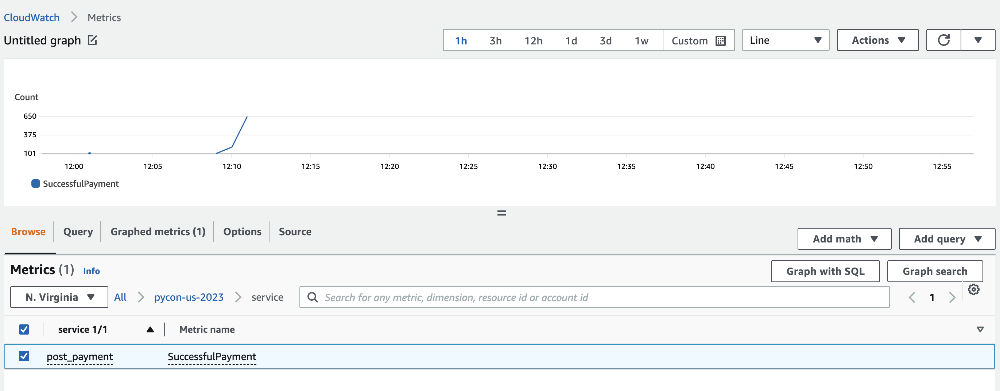

# Observability in Your Application

One of the fundamental things that changes with serverless applications is how we observe them. In many respects, these types of application force you to be more disciplined. There is no server or container that you can connect to in order to review logs, or look at network connections, or run local tracing. You have to build this in at the start.

There are three pillars of observability - logging, metrics, and traces. The application you've deployed has mechanisms to emit all three, courtesy of [AWS Lambda Powertools for Python](https://awslabs.github.io/aws-lambda-powertools-python/latest/). Let's dive into each in turn.

## Logging

Logging captures application events as they occur and are really helpful for troubleshooting systems that are not behaving as expected. You may have experience using Python's [logging module](https://docs.python.org/3/library/logging.html) in other applications you've used or written.

Why use the Logger utility in Powertools instead of another module? Its opinionated design makes it easy to capture both structured event data _and_ context about function execution.

By default data is emitted in JSON format. This simple decision makes it easier to discover data, regardless of whether you're using the simple search field within [CloudWatch Log Groups and Streams](https://docs.aws.amazon.com/AmazonCloudWatch/latest/logs/SearchDataFilterPattern.html), [Amazon CloudWatch Logs Insights](https://docs.aws.amazon.com/AmazonCloudWatch/latest/logs/AnalyzingLogData.html), or downstream services like [Splunk](https://www.splunk.com). JSON keys are autodiscovered, making it possible to use them in your query and filter terms. You don't have to define a complex regular expression so your system can make sense of your log data. You also don't have to maintain a complex logging formatter yourself, either. 

You're logging context data about your function execution through the use of a decorator in your function handlers. This allows you to log [contextual data about your Lambda function](https://awslabs.github.io/aws-lambda-powertools-python/latest/core/logger/#capturing-lambda-context-info). For example, your [get_balance handler](./src/get_balance/app.py) uses `@logger.inject_lambda_context` to capture things like:

* Whether the invocation was a cold start

* Function name

* Function ARN

* Function memory size

* Request ID

```bash
@logger.inject_lambda_context(
    correlation_id_path=correlation_paths.API_GATEWAY_REST,
    log_event=True
)
```

By default, a simple `log` statement will also include [standard structured keys](https://awslabs.github.io/aws-lambda-powertools-python/latest/core/logger/#standard-structured-keys). You can optionally include other keys that will be present in each logged event. Refer to the Powertools documentation for more information about the [Logger](https://awslabs.github.io/aws-lambda-powertools-python/latest/core/logger) utility. The log entry below is generated by single `log.info()` call that is made in the [src/post_payment/app.py](./src/post_payment/app.py) file. 

```json
{
    "level": "INFO",
    "location": "post_payment:45",
    "message": {
        "user_id": "user300",
        "amount": 300,
        "outcome": "success",
        "payment_date": "2023-05-01",
        "timestamp": "2023-04-05T12:11:32.213776"
    },
    "timestamp": "2023-04-05 12:11:32,213+0000",
    "service": "post_payment",
    "sampling_rate": "0.1",
    "cold_start": false,
    "function_name": "pycon-us-2023-PostPaymentFunction-NTbuUbZMbvkx",
    "function_memory_size": "256",
    "function_arn": "arn:aws:lambda:us-east-1:408023262302:function:pycon-us-2023-PostPaymentFunction-NTbuUbZMbvkx",
    "function_request_id": "0139ba78-4028-42c5-88ec-1ef3422588c3",
    "correlation_id": "dfd3cb6e-ebe2-4049-a44b-eabe84e51956",
    "xray_trace_id": "1-642d6574-07d837110210c9ae156a1712"
}
```

## Metrics

Lambda functions emit a number of [standard metrics related to invocations, performance, and concurrency](https://docs.aws.amazon.com/lambda/latest/dg/monitoring-metrics.html). While this is helpful, there is often time a need to publish custom, business-level metrics. You are collecting such metrics - payment information - in your Lambda application. AWS Lambda Powertools makes this trivial, and does away with the need to use the [boto3 CloudWatch.Client.put_metric_data](https://boto3.amazonaws.com/v1/documentation/api/latest/reference/services/cloudwatch/client/put_metric_data.html) function.

Powertools emits metric data into CloudWatch logs using [Embedded Metric Format](https://docs.aws.amazon.com/AmazonCloudWatch/latest/monitoring/CloudWatch_Embedded_Metric_Format_Specification.html). The CloudWatch Logs service, in turn, consumes these entries asynchronously so your Lambda function can return to providing business value without blocking on a metric write.


_From [AWS Lambda Powertools for Python](https://awslabs.github.io/aws-lambda-powertools-python/latest/core/metrics/)_

You are writing metrics to the _pycon-us-2023_ namespace in your post_payment function. You are collecting the total amount of successful and unsuccessful payment amounts. The Metrics utility emits the following representative data to a log stream in your CloudWatch **PostPaymentFunction** log group.

```json
{
    "_aws": {
        "Timestamp": 1680696692214,
        "CloudWatchMetrics": [
            {
                "Namespace": "pycon-us-2023",
                "Dimensions": [
                    [
                        "service"
                    ]
                ],
                "Metrics": [
                    {
                        "Name": "SuccessfulPayment",
                        "Unit": "Count"
                    }
                ]
            }
        ]
    },
    "service": "post_payment",
    "SuccessfulPayment": [
        300
    ]
}
```

This, in turn, creates a `SuccessfulPayment` CloudWatch Metric in the `pycon-us-2023` namespace.




## Tracing


