# Observability in Your Application

One of the fundamental things that changes with serverless applications is how we observe them. In many respects, these types of application force you to be more disciplined. There is no server or container that you can connect to in order to review logs, or look at network connections, or run local tracing. You have to build this in at the start.

There are three pillars of observability - logging, metrics, and traces. The application you've deployed has mechanisms to emit all three, courtesy of [AWS Lambda Powertools for Python](https://awslabs.github.io/aws-lambda-powertools-python/latest/). Let's dive into each in turn.

## Logging

Logging captures application events as they occur and are really helpful for troubleshooting systems that are not behaving as expected. You may have experience using Python's [logging module](https://docs.python.org/3/library/logging.html) in other applications you've used or written.

Why use the Logger utility in Powertools instead of another module? Its opinionated design makes it easy to capture both structured event data _and_ context about function execution.

By default data is emitted in JSON format. This simple decision makes it easier to discover data, regardless of whether you're using the simple search field within [CloudWatch Log Groups and Streams](https://docs.aws.amazon.com/AmazonCloudWatch/latest/logs/SearchDataFilterPattern.html), [Amazon CloudWatch Logs Insights](https://docs.aws.amazon.com/AmazonCloudWatch/latest/logs/AnalyzingLogData.html), or downstream services like [Splunk](https://www.splunk.com). JSON keys are autodiscovered, making it possible to use them in your query and filter terms. You don't have to define a complex regular expression so your system can make sense of your log data. You also don't have to maintain a complex logging formatter yourself, either. 

You're logging context data about your function execution through the use of a decorator in your function handlers. This allows you to log [contextual data about your Lambda function](https://awslabs.github.io/aws-lambda-powertools-python/latest/core/logger/#capturing-lambda-context-info). For example, your [get_balance handler](./src/get_balance/app.py) uses `@logger.inject_lambda_context` to capture things like:

* Whether the invocation was a cold start

* Function name

* Function ARN

* Function memory size

* Request ID

```bash
@logger.inject_lambda_context(
    correlation_id_path=correlation_paths.API_GATEWAY_REST,
    log_event=True
)
```

By default, a simple `log` statement will also include [standard structured keys](https://awslabs.github.io/aws-lambda-powertools-python/latest/core/logger/#standard-structured-keys). You can optionally include other keys that will be present in each logged event. Refer to the Powertools documentation for more information about the [Logger](https://awslabs.github.io/aws-lambda-powertools-python/latest/core/logger) utility. The log entry below is generated by single `log.info()` call that is made in the [src/post_payment/app.py](./src/post_payment/app.py) file. 

```json
{
    "level": "INFO",
    "location": "post_payment:45",
    "message": {
        "user_id": "user300",
        "amount": 300,
        "outcome": "success",
        "payment_date": "2023-05-01",
        "timestamp": "2023-04-05T12:11:32.213776"
    },
    "timestamp": "2023-04-05 12:11:32,213+0000",
    "service": "post_payment",
    "sampling_rate": "0.1",
    "cold_start": false,
    "function_name": "pycon-us-2023-PostPaymentFunction-NTbuUbZMbvkx",
    "function_memory_size": "256",
    "function_arn": "arn:aws:lambda:us-east-1:408023262302:function:pycon-us-2023-PostPaymentFunction-NTbuUbZMbvkx",
    "function_request_id": "0139ba78-4028-42c5-88ec-1ef3422588c3",
    "correlation_id": "dfd3cb6e-ebe2-4049-a44b-eabe84e51956",
    "xray_trace_id": "1-642d6574-07d837110210c9ae156a1712"
}
```

### Making Use of Structured Logs

The primary benefit of structured logging is that it becomes much easier to search logs. In this example, you will see how to search for payment requests from specific users using [CloudWatch Logs Insights](https://docs.aws.amazon.com/AmazonCloudWatch/latest/logs/AnalyzingLogData.html).


The query below uses the **PostPaymentFunctionLogGroup** to retrieve warm invokes where is no cold start. What is interesting is the ability to filter results using the non-standard `cold_start` field.

```bash
fields @timestamp, @message, @logStream, @logStream
| filter cold_start = 0
| filter location like /post_payment/
```

Because your logs are structured, CloudWatch Logs Insights was able to discover fields automatically. Below is a representative image of all the discovered fields in the log streams in this log group.

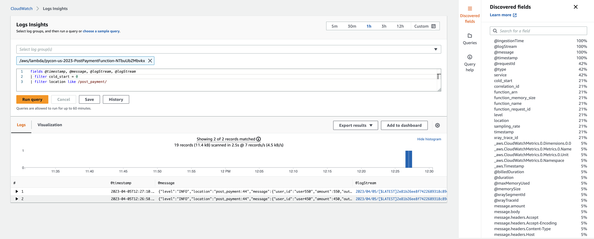

Where things get more interesting is that CloudWatch Logs Insights allows you to query _multiple_ log groups. For example, if you wanted to find out the corresponding API Gateway log entry that matches `correlation_id` '193dce91-0e1b-4d4e-8cb2-a7fe5cbafa39' in your Lambda function, you can run the following query:

```bash
fields @timestamp, service, correlation_id, @log, @message
| filter (correlation_id = '193dce91-0e1b-4d4e-8cb2-a7fe5cbafa39' or requestId = '193dce91-0e1b-4d4e-8cb2-a7fe5cbafa39')
```

In this case, `correlation_id` is used in your Lambda log and `requestId` is used in your API Gateway logs. In this example, you can see the relevant access log data.

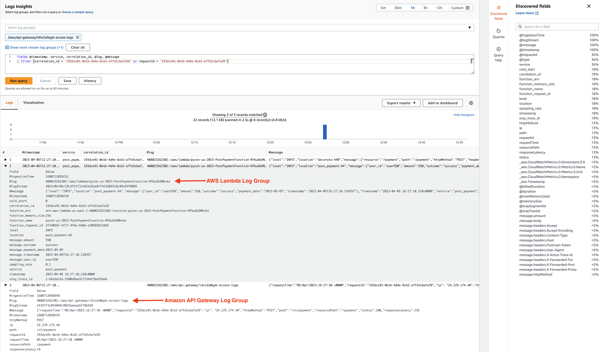

NOTE: The [post_payment function handler](./src/post_payment/app.py) is making use of the `correlation_id_path=correlation_paths.API_GATEWAY_REST` argument to the `@logger.inject_lambda_context` decorator. This is why the filter makes use of the `correlation_id` (AWS Lambda) and `requestId` (API Gateway). The built-in correlation paths can be found in the [awslabs/aws-lambda-powertools-python](https://github.com/awslabs/aws-lambda-powertools-python/blob/develop/aws_lambda_powertools/logging/correlation_paths.py) repository.

## Metrics

Lambda functions emit a number of [standard metrics related to invocations, performance, and concurrency](https://docs.aws.amazon.com/lambda/latest/dg/monitoring-metrics.html). While this is helpful, there is often time a need to publish custom, business-level metrics. You are collecting such metrics - payment information - in your Lambda application. AWS Lambda Powertools makes this trivial, and does away with the need to use the [boto3 CloudWatch.Client.put_metric_data](https://boto3.amazonaws.com/v1/documentation/api/latest/reference/services/cloudwatch/client/put_metric_data.html) function.

Powertools emits metric data into CloudWatch logs using [Embedded Metric Format](https://docs.aws.amazon.com/AmazonCloudWatch/latest/monitoring/CloudWatch_Embedded_Metric_Format_Specification.html). The CloudWatch Logs service, in turn, consumes these entries asynchronously so your Lambda function can return to providing business value without blocking on a metric write.


_From [AWS Lambda Powertools for Python](https://awslabs.github.io/aws-lambda-powertools-python/latest/core/metrics/)_

You are writing metrics to the _pycon-us-2023_ namespace in your post_payment function. You are collecting the total amount of successful and unsuccessful payment amounts. The Metrics utility emits the following representative data to a log stream in your CloudWatch **PostPaymentFunction** log group.

```json
{
    "_aws": {
        "Timestamp": 1680696692214,
        "CloudWatchMetrics": [
            {
                "Namespace": "pycon-us-2023",
                "Dimensions": [
                    [
                        "service"
                    ]
                ],
                "Metrics": [
                    {
                        "Name": "SuccessfulPayment",
                        "Unit": "Count"
                    }
                ]
            }
        ]
    },
    "service": "post_payment",
    "SuccessfulPayment": [
        300
    ]
}
```

This, in turn, creates a `SuccessfulPayment` CloudWatch Metric in the `pycon-us-2023` namespace.

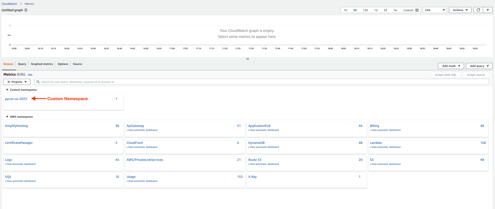
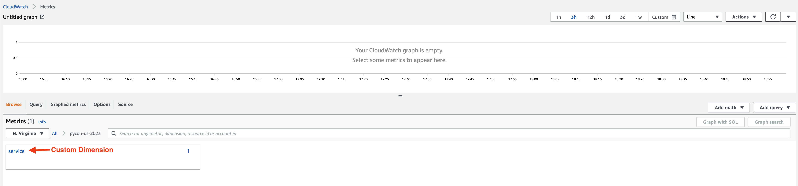
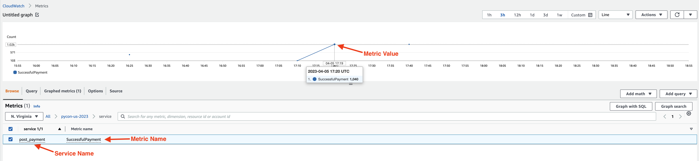


## Tracing

The services you are using in your serverless application are integrated with [AWS X-Ray](https://aws.amazon.com/xray/), a service designed to allow engineers to trace requests as they travel through your application. This means that our services can add a trace ID to a new request if one is not already present and it can add to an existing trace. In this manner, requests that flow to your **CardApi** are traced. The downstream **GetBalanceFunction** and **PostPaymentFunction** can add information to these traces.

**NOTE:** AWS X-Ray will sample requests. This means that not all requests will necessarily be traced. Please refer to the [AWS X-Ray documentation](https://docs.aws.amazon.com/xray/latest/devguide/xray-console-sampling.html) for information on configuring sampling rules.

Let's explore the capabilities afforded by using AWS X-Ray.

## Viewing the Service Map

AWS X-Ray will generate a service map our our serverless application because you've enabled tracing in the Globals section of your [SAM template](./template.yaml). Even if you don't instrument your code you will still have a service map generated. Below is a sample map of your application, including the **CardApi** API Gateway and **PostPaymentFunction** and **** Lambda functions.

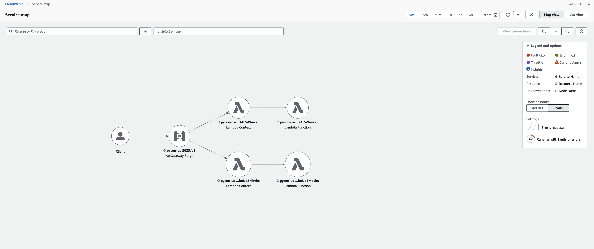

You have the ability to drill down into specific nodes if necessary.

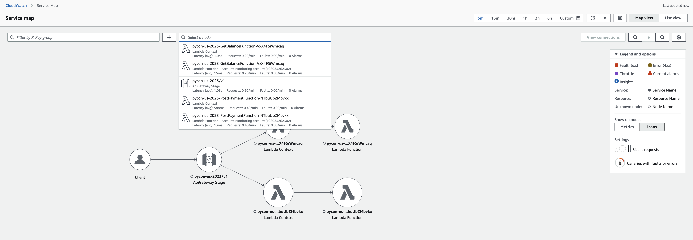

## Viewing and Searching Traces

You can dig deeper into interactions by viewing traces for a given period. The default view presents all traces for the period.

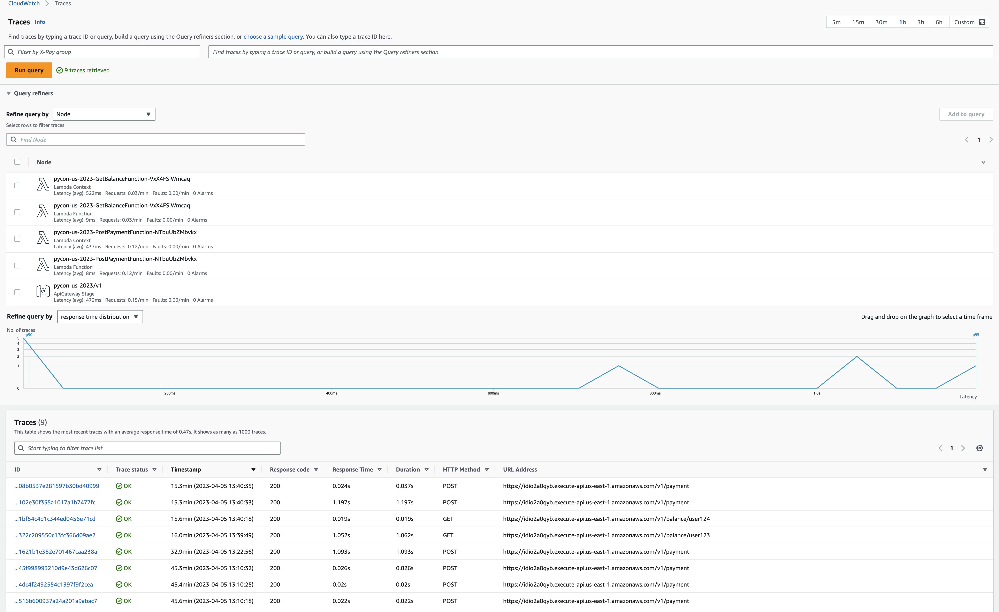

You can dig into representative traces to get more detailed information. In this example, a request to the **GetBalanceFunction** is explored.

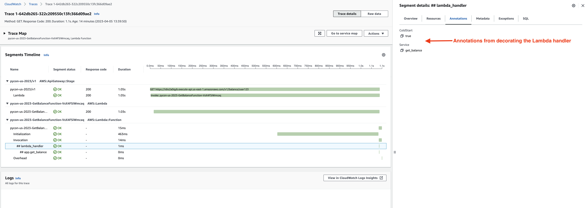

You can see each of the segments of the trace. Each segment includes the service, response code, and duration. In this manner, you can see not just that an interaction occurred but what happened along the way. Because you are using AWS Lambda Powertools, you can also see default annotations added to segments. The decorator `@tracer.capture_lambda_handler` coupled with the `POWERTOOLS_SERVICE_NAME` variable in your [template.yaml](./template.yaml) makes this possible. You don't need to further add to your code - you simply made use of built-in functionality.

If you want to further instrument your code, you can take advantage of annotations and metadata. Your **PostPaymentFunction** includes the same decorator as your **GetBalanceFunction** and _also_ includes an annotation - the `user_id` that made the payment.

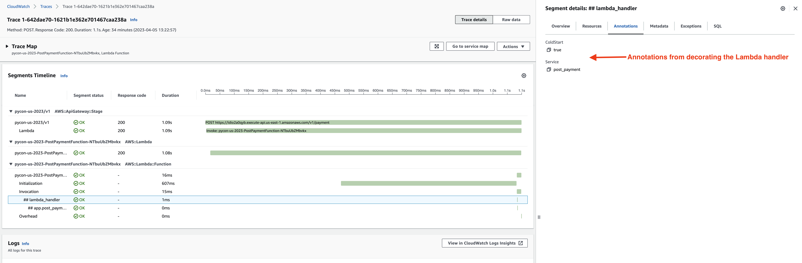

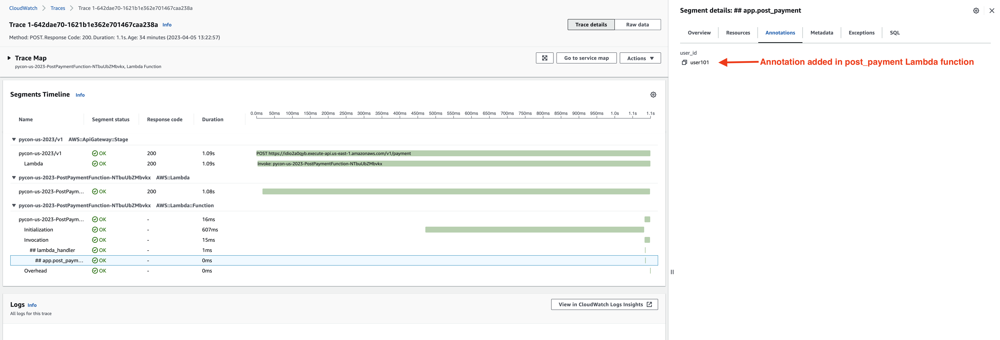

Annotations can be helpful if you need to query your traces to dive deeper along a set of properties. Because you have these annotations in your traces, you can run queries in AWS X-Ray to:

* Find traces for the `post_payment` service

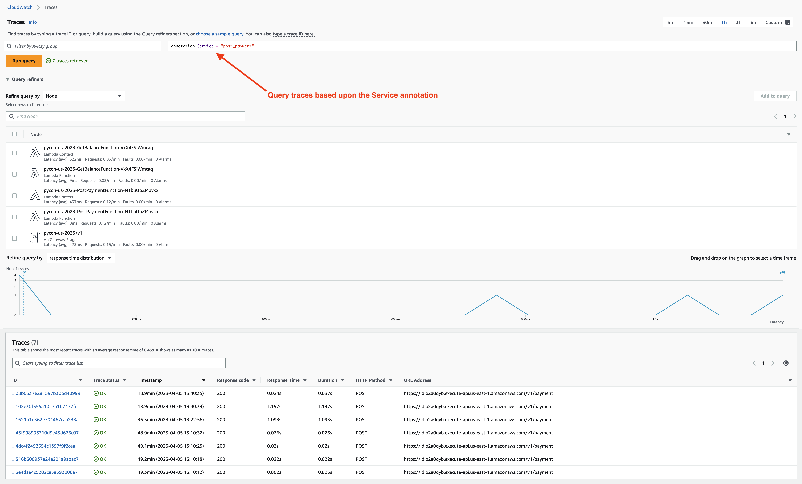

* Find traces of cold starts

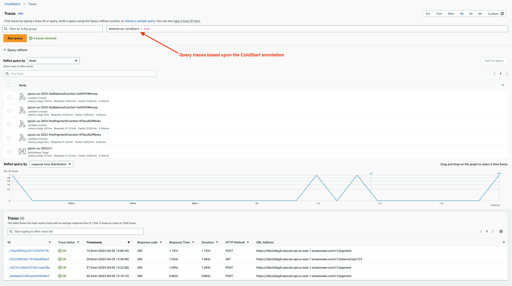

* Find traces that match a specific `user_id`

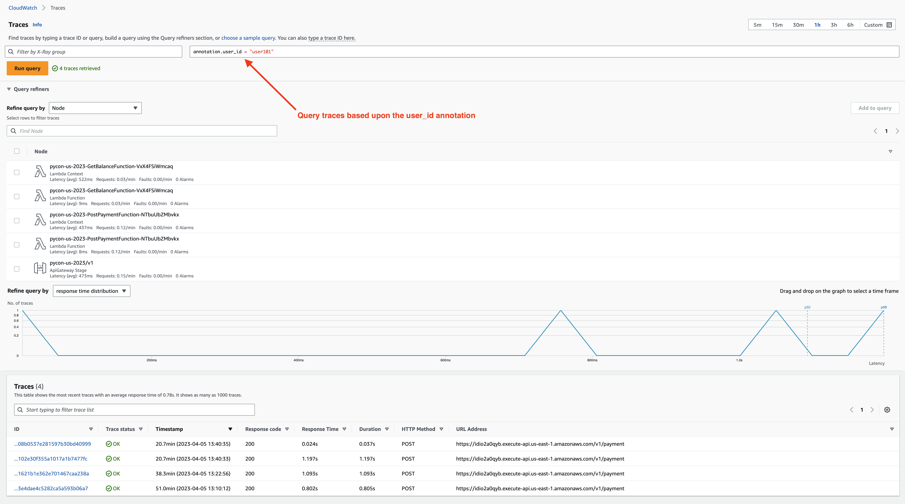

## What's Next?

Now that you have a sense of how to instrument components of your API for observability, you will [take stock of the ground you've covered in this repository](./README-CONCLUSION.md).
